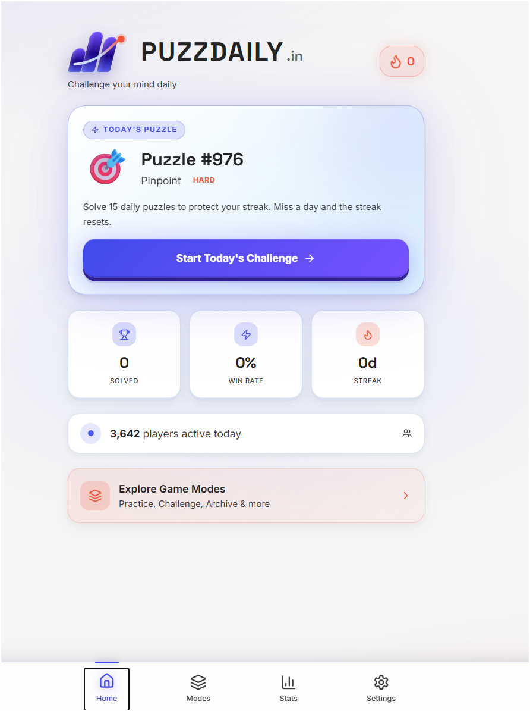
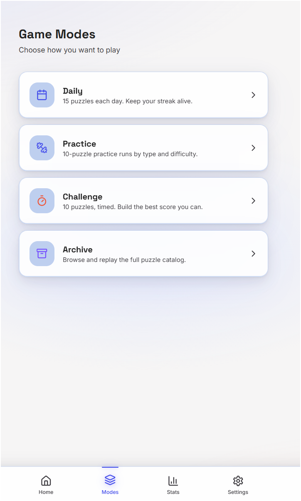
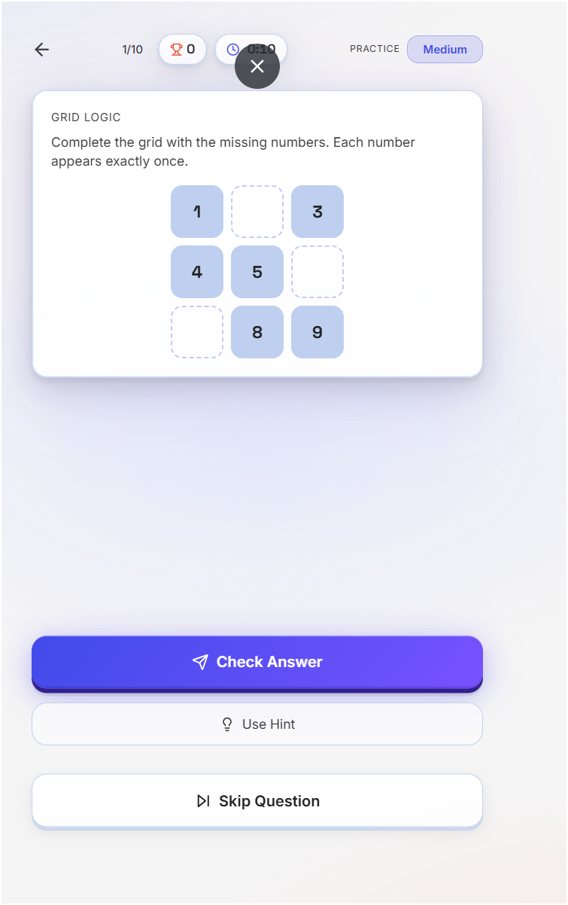
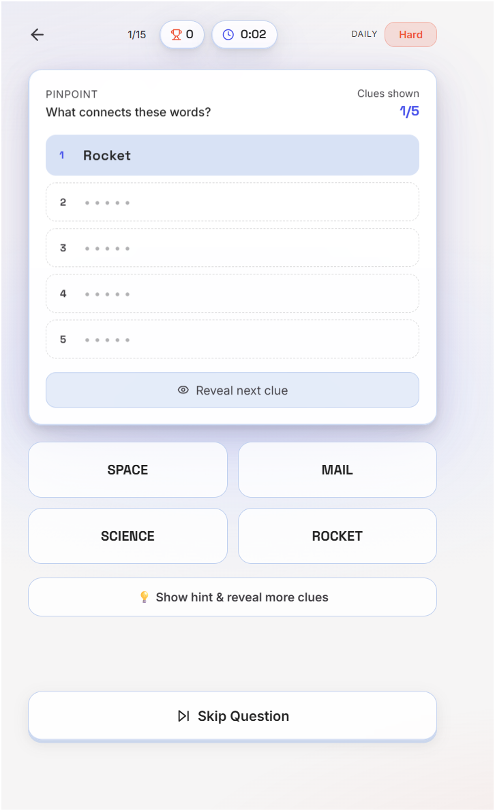
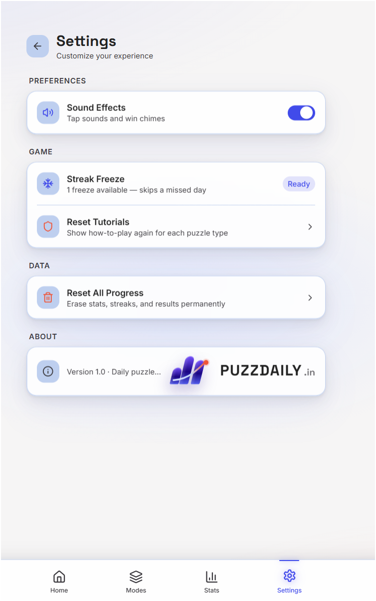
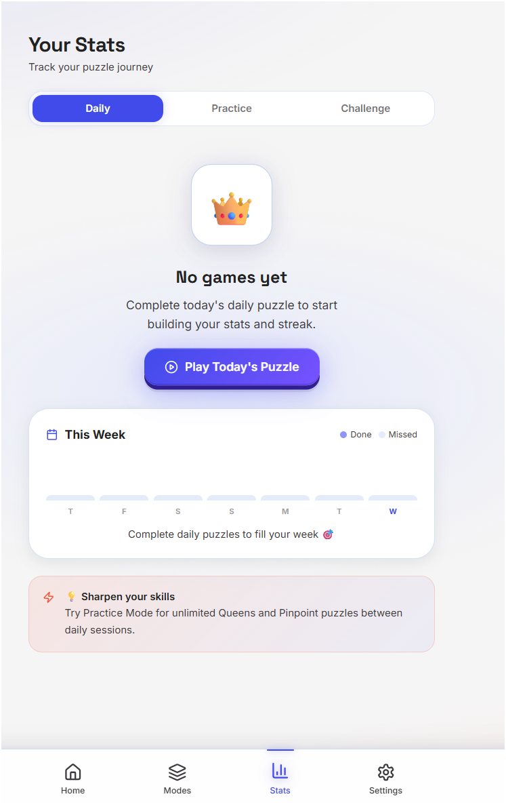

# 🧩 Puzzlogic Game

<p align="center">

  

  <br><br>

  <a href="https://puzzlogic-game-ja4v.onrender.com/modes">
    
  </a>

  <a href="https://github.com/Ganeshbasani/Puzzlogic--Game">
    
  </a>

</p>

<p align="center">

  
  
  
  
  
  

</p>

<p align="center">

  <strong>A polished, mobile-first daily puzzle platform designed for short, rewarding brain-training sessions.</strong>

</p>

---

## 🚀 Live Application

### 🎮 Play Puzzlogic Game

**Live Demo:**  
https://puzzlogic-game-ja4v.onrender.com/modes

### 📦 GitHub Repository

https://github.com/Ganeshbasani/Puzzlogic--Game

---

# 📖 Overview

**Puzzlogic Game** is a mobile-first daily puzzle platform built to provide quick, engaging and repeatable brain-training sessions.

The application combines multiple puzzle categories, dedicated game modes, interactive tutorials, streak tracking, statistics, sound effects and persistent gameplay state into a single polished experience.

The project is structured as a modern full-stack monorepo with a production-ready frontend and backend architecture designed to support future cloud synchronization, authentication, leaderboards and persistent server-side game data.

The current deployed application focuses on the core gameplay experience and local-first persistence.

---

# ✨ Features

## 🧠 Multiple Puzzle Types

Puzzlogic provides different puzzle styles that challenge different types of reasoning:

- 👑 **Queens** — Spatial and logical placement puzzles
- 🎯 **Pinpoint** — Word association and deduction puzzles
- 🧩 **Logic Riddle** — Lateral thinking and logical reasoning
- 🔢 **Number Grid** — Numerical and pattern-based logic puzzles

---

# 🎮 Game Modes

## 📅 Daily Mode

- 15 puzzles per daily session
- Designed around a daily habit loop
- Streak tracking
- Difficulty-based challenges
- Daily progress tracking
- Countdown/reset behavior

## 🏋️ Practice Mode

- Practice individual puzzle categories
- Multiple difficulty levels
- Designed for unlimited practice
- Improve specific puzzle-solving skills

## ⏱️ Challenge Mode

- Timed puzzle sessions
- Score-oriented gameplay
- Designed for competitive personal performance
- Encourages faster and more accurate solving

## 📚 Archive Mode

- Browse historical puzzles
- Replay previous puzzle sessions
- Explore the puzzle catalogue

---

# 📊 Progress & Statistics

The application tracks gameplay progress and provides users with performance information such as:

- Solved puzzles
- Accuracy
- Win rate
- Current streak
- Weekly activity
- Daily progress
- Mode-specific performance
- Puzzle completion history

The statistics experience is designed to make improvement visible over time.

---

# 🔥 Streak System

The Daily experience includes a streak-based progression system.

Users can:

- Build consecutive daily streaks
- Track their current streak
- Maintain progress through the daily puzzle cycle
- Use the built-in **Streak Freeze** functionality when available

The streak system encourages consistent daily engagement without requiring long gaming sessions.

---

# 💡 Interactive Tutorials

Each puzzle type can provide an integrated **How to Play** tutorial.

Tutorials explain:

- The objective of the puzzle
- How to interact with the puzzle
- How answers are entered
- Important gameplay rules
- Useful hints and interactions

Tutorial progress can also be reset from Settings.

---

# 🔊 Sound Effects

Puzzlogic includes programmatic sound effects using the browser's **Web Audio API**.

This provides:

- Button interaction feedback
- Gameplay feedback
- Success/win sounds
- Lightweight audio without requiring a large collection of audio files

Sound effects can be enabled or disabled from Settings.

---

# 💾 Local-First Persistence

The current client application uses browser-based persistence for important gameplay state.

Persisted information includes:

- Game progress
- Statistics
- Streak information
- Gameplay state
- User preferences
- Sound settings
- Tutorial state

This allows the application to remain usable without requiring an account for the core gameplay experience.

---

# 📸 Application Showcase

## 🏠 Home Dashboard



The dashboard provides quick access to the daily puzzle, current streak, solved count, win rate and available game modes.

---

## 🎮 Game Modes



The Game Modes screen provides access to Daily, Practice, Challenge and Archive gameplay.

---

## 🔢 Number Grid Gameplay



Number Grid challenges users to complete missing values while following the puzzle's logical constraints.

---

## 🎯 Pinpoint Gameplay



Pinpoint presents progressive clues and requires players to identify the connection between them.

---

## ⚙️ Settings



The Settings screen provides controls for sound effects, streak freeze, tutorial reset and progress management.

---

## 📊 Statistics



The Statistics screen allows users to review their puzzle performance and daily progress.

---

# 🏗️ Architecture

The project follows a modular full-stack monorepo structure.

```text
                         ┌─────────────────────────┐
                         │     Puzzlogic Client    │
                         │      React + Vite       │
                         └────────────┬────────────┘
                                      │
              ┌───────────────────────┼───────────────────────┐
              │                       │                       │
              ▼                       ▼                       ▼
       ┌──────────────┐       ┌──────────────┐       ┌──────────────┐
       │ Puzzle Engine│       │ Sound Service│       │ Progress Store│
       │              │       │ Web Audio API│       │ localStorage  │
       └──────┬───────┘       └──────────────┘       └──────┬───────┘
              │                                              │
              └──────────────────┬───────────────────────────┘
                                 ▼
                        ┌────────────────────┐
                        │    React UI Layer  │
                        │ Tailwind + Motion   │
                        └──────────┬─────────┘
                                   │
                                   ▼
                        ┌────────────────────┐
                        │   Backend Layer    │
                        │ Node.js + Prisma   │
                        └──────────┬─────────┘
                                   │
                                   ▼
                        ┌────────────────────┐
                        │      Database      │
                        └────────────────────┘
````

---

# 🧱 Project Structure

```text
puzzlogic-game/
│
├── backend/
│   ├── prisma/
│   │   └── ...
│   ├── src/
│   │   └── ...
│   ├── package.json
│   └── tsconfig.json
│
├── frontend/
│   ├── src/
│   │   ├── components/
│   │   ├── pages/
│   │   ├── games/
│   │   ├── services/
│   │   ├── store/
│   │   └── ...
│   ├── public/
│   ├── package.json
│   └── ...
│
├── docs/
│   ├── screenshots/
│   │   ├── game-modes.png
│   │   ├── gameplay-grid.png
│   │   ├── gameplay-pinpoint.png
│   │   ├── home-dashboard.png
│   │   ├── settings.png
│   │   └── statistics.png
│   │
│   ├── api-docs.md
│   ├── architecture.md
│   ├── deployment.md
│   └── game-design.md
│
├── .env.example
├── .gitignore
├── docker-compose.yml
├── README.md
└── ...
```

---

# 🛠️ Tech Stack

| Technology        | Purpose                           |
| ----------------- | --------------------------------- |
| **React**         | Frontend UI                       |
| **TypeScript**    | Type-safe application development |
| **Vite**          | Frontend build tooling            |
| **Tailwind CSS**  | Responsive styling                |
| **Node.js**       | Backend runtime                   |
| **Prisma**        | Database ORM                      |
| **Web Audio API** | Programmatic sound effects        |
| **localStorage**  | Client-side persistence           |
| **Git / GitHub**  | Version control                   |
| **Render**        | Production deployment             |

---

# 🎯 Design Principles

Puzzlogic is designed around several core principles.

## 📱 Mobile First

The interface is designed primarily around a mobile gameplay experience while remaining responsive across larger screens.

## ⚡ Fast Sessions

Individual puzzles are designed to be completed in short sessions rather than requiring long play periods.

## 🧠 Meaningful Difficulty

Different puzzle categories provide different forms of reasoning and problem solving.

## 🔄 Repeatable Gameplay

Daily, Practice, Challenge and Archive modes provide multiple ways to continue playing.

## 💾 Reliable Progress

Important gameplay state is persisted locally so users can continue their experience across sessions.

## 🎨 Clean Interface

The UI focuses on clear hierarchy, large interaction areas, visual feedback and minimal friction.

---

# 🔐 Environment Variables

Create an environment file based on the provided example:

```bash
cp .env.example .env
```

### Windows PowerShell

```powershell
Copy-Item .env.example .env
```

Configure the required environment variables according to the backend and deployment configuration.

> ⚠️ Never commit production secrets, database credentials or private API keys to GitHub.

---

# 💻 Getting Started

## 1. Clone the Repository

```bash
git clone https://github.com/Ganeshbasani/Puzzlogic--Game.git
```

## 2. Enter the Project

```bash
cd Puzzlogic--Game
```

## 3. Install Frontend Dependencies

```bash
cd frontend
npm install
```

## 4. Start the Frontend

```bash
npm run dev
```

The development server will normally be available through the URL displayed by Vite.

---

# ⚙️ Backend Setup

Open another terminal and navigate to the backend:

```bash
cd backend
npm install
```

Configure the required environment variables and database connection.

Then run the backend development server using the scripts defined in:

```text
backend/package.json
```

---

# 🧪 Development Checklist

Before creating a production deployment, verify:

* Frontend builds successfully
* Backend starts successfully
* Database configuration is valid
* Environment variables are configured
* Puzzle modes load correctly
* Daily puzzles generate correctly
* Statistics update correctly
* Local persistence works correctly
* Mobile layout remains responsive
* Sound settings work correctly
* Tutorials work correctly
* Navigation works correctly

---

# 🚀 Deployment

The application is deployed using **Render**.

### 🌐 Production Application

[https://puzzlogic-game-ja4v.onrender.com/modes](https://puzzlogic-game-ja4v.onrender.com/modes)

The repository contains deployment documentation under:

```text
docs/deployment.md
```

The project can be configured for separate frontend and backend services depending on the deployment architecture.

---

# 📚 Documentation

Additional technical documentation is available in the `docs/` directory.

| Document          | Description                |
| ----------------- | -------------------------- |
| `architecture.md` | Application architecture   |
| `api-docs.md`     | API documentation          |
| `deployment.md`   | Deployment information     |
| `game-design.md`  | Puzzle and gameplay design |
| `screenshots/`    | Application UI screenshots |

---

# 🔌 Backend & API

The repository includes a backend foundation using:

* Node.js
* TypeScript
* Prisma
* Database integration
* API-oriented architecture

The backend is structured to support future features including:

* User accounts
* Cloud-synchronized progress
* Persistent game history
* Global leaderboards
* Cross-device synchronization
* Server-side statistics
* Authentication

---

# 🔮 Future Enhancements

Planned areas for future development include:

* 🔐 User authentication
* ☁️ Cloud save and synchronization
* 🏆 Global leaderboards
* 👥 Player profiles
* 🌎 Multiplayer / competitive gameplay
* 📈 Expanded analytics
* 🗓️ Larger historical puzzle archive
* 🔔 Daily reminders and notifications
* 🎖️ Achievements and badges
* 📱 Progressive Web App support
* 🌐 Additional accessibility improvements
* 🌍 Localization and multi-language support

---

# 🤝 Contributing

Contributions, suggestions and improvements are welcome.

## 1. Fork the Repository

Use GitHub's **Fork** button to create your own copy.

## 2. Clone Your Fork

```bash
git clone <your-fork-url>
```

## 3. Create a Feature Branch

```bash
git checkout -b feature/your-feature-name
```

## 4. Make Your Changes

Implement and test your changes locally.

## 5. Commit Your Changes

```bash
git add .
git commit -m "feat: describe your change"
```

## 6. Push the Branch

```bash
git push origin feature/your-feature-name
```

## 7. Open a Pull Request

Submit a Pull Request describing the changes and why they are useful.

---

# 🐛 Bug Reports & Feature Requests

If you find a bug or have an idea for improving Puzzlogic Game, please open an issue in the GitHub repository.

### GitHub Repository

[https://github.com/Ganeshbasani/Puzzlogic--Game](https://github.com/Ganeshbasani/Puzzlogic--Game)

When reporting a bug, include:

* Description of the issue
* Steps to reproduce
* Expected behavior
* Actual behavior
* Browser/device information
* Screenshot or screen recording when useful

---

# 🔒 Security

Please do not publicly disclose sensitive credentials, API keys, database credentials or other private configuration values.

For security-related issues, contact the project author directly rather than publishing sensitive information in a public issue.

---

# 📄 License

This project is licensed under the **MIT License**.

See the `LICENSE` file for the complete license text.

---

# 👨‍💻 Author

## Ganesh Basani

**GitHub:**
[https://github.com/Ganeshbasani](https://github.com/Ganeshbasani)

**Project:**
[https://github.com/Ganeshbasani/Puzzlogic--Game](https://github.com/Ganeshbasani/Puzzlogic--Game)

---

# 🙏 Acknowledgements

Built with and inspired by the modern web development ecosystem.

Special thanks to the open-source projects and technologies that make this application possible:

* React
* TypeScript
* Vite
* Tailwind CSS
* Node.js
* Prisma
* Web Audio API
* GitHub
* Render

---

# ⭐ Support the Project

If you find **Puzzlogic Game** interesting or useful:

⭐ Star the repository on GitHub
🐛 Report bugs
💡 Suggest improvements
🔧 Contribute code
📢 Share the project

---

<p align="center">

### 🧩 Challenge your mind. One puzzle at a time.

**Puzzlogic Game**

<br>

<a href="https://puzzlogic-game-ja4v.onrender.com/modes">
  🚀 Play Now
</a>
&nbsp;&nbsp;·&nbsp;&nbsp;
<a href="https://github.com/Ganeshbasani/Puzzlogic--Game">
  📦 GitHub
</a>

</p>


This is the **single-copy version**—you can copy the entire block once and paste it directly into `README.md`.
