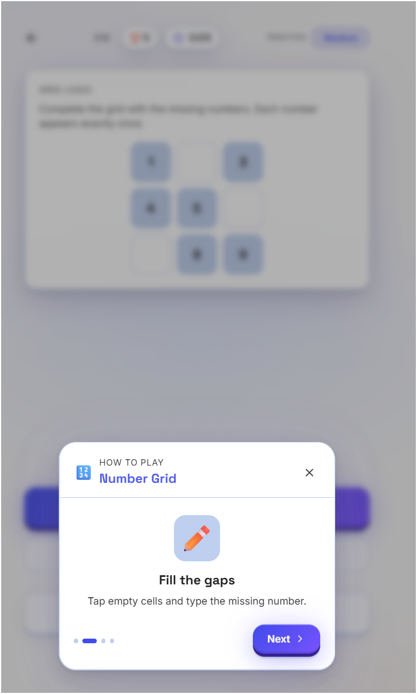

# 🧩 Puzzlogic Game

> A polished, production-ready daily puzzle platform engineered for quick, rewarding brain-training sessions.


[🚀 Live Demo](https://puzzlogic-game-ja4v.onrender.com/modes) &nbsp;•&nbsp; [📦 GitHub Repository](https://github.com/Ganeshbasani/Puzzlogic--Game)

---

## 📸 Application Showcase

| 🏠 Dashboard | 🎮 Game Modes | 🧩 Number Grid |
| :---: | :---: | :---: |
|  |  |  |

| 🎯 Pinpoint | 📖 Interactive Tutorials | 📊 Performance Stats |
| :---: | :---: | :---: |
|  |  |  |

---

## 📌 Overview

**Puzzlogic Game** is an architecture-focused monorepo housing a mobile-first, daily logic puzzle platform. It is engineered around a habit-forming product loop: short, high-satisfaction sessions that combine deterministic daily generation, localized offline persistence, Web Audio synthesis, and dynamic progress analytics.

The current production release features a fully functional client application located in [`frontend/`](./frontend) (**PuzzDaily**), with modular monorepo scaffolding (`backend/`, `shared/`, `docs/`) structured for future cloud-backed state synchronization and server-side leaderboards.

---

## ✨ Key Features

- **🧠 Multi-Category Engine:** Integrated puzzle engines for spatial logic (*Queens*), word association (*Pinpoint*), lateral deductions (*Logic Riddle*), and quantitative patterns (*Number Grid*).
- **📅 Deterministic Daily Loop:** Algorithmic daily session generator with streak retention and automated countdown resets.
- **🎮 Specialized Modes:** Feature-rich support for **Daily**, **Practice** (filtered by category & difficulty), **Challenge** (timed score runs), and **Archive** (historical replaying).
- **🔊 Programmatic Audio:** Dynamic sound synthesis via the native Web Audio API—eliminating bulky audio asset loads.
- **💾 Offline-First Persistence:** Robust local browser storage for statistics, active game state, streak tracking, and customization options.
- **📊 Real-time Analytics:** Advanced performance metrics including accuracy rings, percentile ranking calculations, and weekly activity heatmaps.

---

## 🏗️ System Architecture & Workflow

```text
                                  +-----------------------+
                                  |   Puzzlogic Client    |
                                  |    (Vite / React)     |
                                  +-----------+-----------+
                                              |
        +-------------------------------------+-------------------------------------+
        |                                     |                                     |
+-------v-------+                     +-------v-------+                     +-------v-------+
|  Game Engine  |                     | Sound Service |                     | Progress Store|
| (Session Gen) |                     |  (Web Audio)  |                     | (localStorage)|
+-------+-------+                     +---------------+                     +-------+-------+
        |                                                                           |
        |              +-------------------------------------+                      |
        +------------->| Render Engine (Framer Motion / UI)  |<---------------------+
                       +-------------------------------------+
